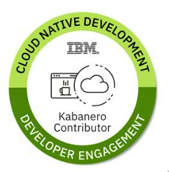

# Contributing to Kabanero

Anyone can contribute to the Kabanero project and we welcome your contributions!

## Contributor License Agreement
If you are contributing code changes via a pull request for anything except trivial changes, you must signoff on the [Individual Contributor License Agreement](https://github.com/kabanero-io/kabanero-website/blob/master/cla/kabanero-cla-individual.pdf) If you are doing this as part of your job you may also wish to get your employer to sign a [CCLA Corporate Contributor License Agreement](https://github.com/kabanero-io/kabanero-website/blob/master/cla/kabanero-cla-corporate.pdf). Instructions how to sign and submit these agreements are located at the top of each document. Trivial changes such as Typos, redundant spaces, minor formatting and spelling errors will be labeled as "CLA trivial", and don't require a signed CLA for consideration.

After we obtain the signed CLA, you are welcome to open a pull request, and the team will be notified for review. We ask you follow these steps through the submission process.

Ensure you run a passing local gradle build explained in the README before opening a PR.
Open PR's against the "integration" branch, as we ensure changes pass our series of verification buckets before pushing to master.
A label will be added "CLA signed" or "CLA trivial" depending on the nature of the change.

A team of "reviewers" will be notified, will perform a review, and if approved will invoke a full integration build.

Based on the results of the build, and if further review is needed, more discussion will occur.

If the reviewer is satisfied with the results, and agrees to the change, the PR will be merged to integration, otherwise the PR will be closed with an explanation and suggestion for follow up.

## Coding Standards

Please ensure you follow the coding standards used throughout the existing code base. Some basic rules include:

- All files must have an Apache 2.0 Copyright notice in the header. For example, see the top of [src/main/content/_layouts/default.html](https://github.com/kabanero-io/kabanero-website/blob/master/src/main/content/_layouts/default.html).
- All PRs must have a passing build.
- For images, ids, and classes use hypens for spacing (ex. `this-is-a-class`)

## Raising issues
Please raise any bug reports on the Kabanero project repository's GitHub issue tracker. Be sure to search the list to see if your issue has already been raised.

A good bug report is one that make it easy for everyone to understand what you were trying to do and what went wrong. Provide as much context as possible so we can try to recreate the issue.

Please open issues in their appropriate repository:

| Repository | Description |
| --- | --- |
| [Appsody Extension](https://github.com/kabanero-io/appsodyExtension) | This repository is an extension to Codewind that adds support for Appsody projects. |
| [Blogs](https://github.com/kabanero-io/blogs) | [Blogs](https://kabanero.io/blog) for the Kabanero.io site |
| [Codewind Templates](https://github.com/kabanero-io/codewind-templates) | Central repository for storing the list of supported code templates for use in Codewind |
| [Stacks](https://github.com/kabanero-io/collections) | Repo contains source of usable Application Stacks |
| [Docs](https://github.com/kabanero-io/docs) | Kabanero documentation and example scripts |
| [Kabanero CLI](https://github.com/kabanero-io/kabanero-command-line) | A command line interface that is used to manage the stacks the Kabanero environment presents |
| [Kabanero Foundation](https://github.com/kabanero-io/kabanero-foundation) | The Kabanero Foundation Instance is a deployment of a Application Stacks in a specific Kubernetes cluster. |
| [Kabanero Operator](https://github.com/kabanero-io/kabanero-operator) | The Kabanero Platform Operator installs Kabanero onto a Kubernetes environment. |
| [Kabanero Website](https://github.com/kabanero-io/kabanero-website) | The source code of the website [Kabanero.io](https://kabanero.io/), `YOU ARE HERE` |

# Local Development setup

This section describes the steps needed to set up your local development environment to contribute changes to the Kabanero.io website. 

The website's front end can be run in isolation using jekyll's own simple web server for convenience. The back end won't be run in this case, but most changes to the website pages, docs, or guides only require only the front end set up anyways. If you would like to run the full front end and back end together you can follow the [back end set up](#back-end-setup) below.

## Front end setup

There are two options for setting up a local development environment on your system:

- Install the development environment locally on your system
- Running the development environment in a Docker container

### Installing the development environment locally on your system

Prereqs:

- [Git](https://git-scm.com/downloads)
- ruby
- gem

Follow these steps:

1. `git clone https://github.com/kabanero-io/kabanero-website.git`
1. `cd kabanero-website`
1. Run `bundle install`
1. Run `./scripts/jekyll_serve_dev.sh` to have Jekyll serve the static site.
   * This script calls `jekyll serve` which builds the site and starts a small server to serve the static files. It will do a live reload anytime a file is changed.
   * This does not run the code we have for the Liberty server in `src/main/java`. To run that code you will need to follow the back end setup instructions.
5. Go to http://localhost:4000/ in your browser

### Running the development environment in a Docker container

Prereqs:

- [Git](https://git-scm.com/downloads)
- [Docker](https://docs.docker.com/install/)

Follow these steps:

1. `git clone https://github.com/kabanero-io/kabanero-website.git`
1. `cd kabanero-website`
1. `docker build -t kabanero-dev .`
1. `docker run -it -d -p 4000:4000 -v <Path-to-Kabanero-website-directory>/:/home/jekyll kabanero-dev`
1. Go to http://localhost:4000/ in your browser

## Back end setup

This process describes how to set up the back end Open Liberty server, which requires Docker. Follow these steps:

Prereqs:

- [Git](https://git-scm.com/downloads)
- [Docker](https://docs.docker.com/install/)
- maven

Follow these steps:

1. Clone this repo: `git clone git@github.com:kabanero-io/kabanero-website.git`
1. `cd` into the root of the repository
1. Run the docker build commmand: `docker build -t kabanero-site -f kube/Dockerfile .`
1. Run the docker site in a docker container: `docker run --rm -p 9443:9443 kabanero-site`
1. Wait a few seconds for the container to start and then go to `https://localhost:9443` in your browser to view the website.

# Deploying your own instance of the Kabanero website to Cloud Foundry

This example uses [IBM Cloud Foundry](https://cloud.ibm.com/cloudfoundry/overview).

Prereqs:

1. A fork of Kabanero.io
   * Go to [Kabanero.io website repo](https://github.com/kabanero-io/kabanero-website) and click Fork in the upper right.
1. An [IBM Cloud](https://cloud.ibm.com) account

## Deploy a test instance using travis and your fork
1. If you haven't already done so, go to [Travis-ci](https://travis-ci.com) and [Sign up with GitHub](https://travis-ci.com/signin).
1. Accept the Authorization of Travis CI. You’ll be redirected to GitHub.
1. Click on your account in travis-ci and under the "Repositories" section click the button next to the kabanero-website repository to activate it.
1. Click on the Dashboard tab at the top of the page and under **Active repositories** click on **kabanero-website**.
1. [Follow these steps](https://docs.travis-ci.com/user/environment-variables/#defining-variables-in-repository-settings) to set the list of environment variables needed for Travis to successfully build and push your fork. You need to set the following variables
   * `IBM_CLOUD_ORGANIZATION` - IBM Cloud Foundry Organization to deploy to
      1. You can go to your [IBM Cloud Foundry Account](https://cloud.ibm.com/account/cloud-foundry) to see your org
   * `IBM_CLOUD_SPACE` - IBM Cloud Foundry space (within the declared organization) to deploy to
      1. You can go to your [IBM Cloud Foundry Account](https://cloud.ibm.com/account/cloud-foundry) which lists your organizations. Click on one to view spaces within the org. You may need to create one.
   * `IBM_CLOUD_API_KEY` - IBM Cloud credentials to login to cloud foundry via ibmcloud cli for the specified API endpoint
      1. **Note: For security reasons **do not** activate the "DISPLAY VALUE IN BUILD LOG" button** this is turned off by default.
      1. Go to [IBM Cloud Access](https://cloud.ibm.com/iam/apikeys) and create an API key for your account.
   * `IBM_CLOUD_API` - IBM Cloud API endpoint to deploy to
      1. For example `https://cloud.ibm.com`
   * `PAT` - GitHub Personal Access Token, which is required to avoid build failures due to [GitHub rate limiting](https://developer.github.com/v3/#rate-limiting).
      1. **Note: For security reasons **do not** activate the "DISPLAY VALUE IN BUILD LOG" button** this is turned off by default.
      1. Head over to [GitHub](https://github.com/settings/tokens) and generate a personal access token (**Make sure to leave all the boxes under "Select scopes" unchecked**) then copy the generated token value and use it as the value for the environment variable. Instructions on generating a github access token can be found on the [GitHub help page](https://help.github.com/en/articles/creating-a-personal-access-token-for-the-command-line).
    * `JEKYLL_DRAFT_GUIDES` - This is Optional. Set this to `"true"` if you want the site to render the draft-guides

   * **Optional**: you can set these environment variables to specify the repositories and branches of blogs and docs to be cloned from
      * `DOCS_GIT_URL` - Git url to clone for the docs repository (https://github.com/kabanero-io/docs.git by default)
      * `DOCS_GIT_REVISION` - (master by default)
      * `BLOGS_GIT_URL` - Git url to clone for the blogs repository (https://github.com/kabanero-io/blogs.git by default)
      * `BLOGS_GIT_REVISION` - (master by default)

1. Finally from [Travis-ci](https://travis-ci.com) click on your forked repository for the kabanero-website then click on the dropdown button labled 'More options' on the right hand side of the window above the 'Restart build' button. From the dropdown click on 'Trigger build', select a branch you want deployed to Cloud Foundry and click on 'Trigger custom build'. The job will start immediately and takes about 10 minutes to deploy.

## Earn the Kabanero Contribution badge

Contribute to the Kabanero Open Source communities and earn a badge! With this badge, you earn a right to brag in front of your colleagues and friends! You can also show this badge to anyone and prove that you have been recognized by your contribution to the open source Kabanero project.

https://www.youracclaim.com/org/ibm/badge/kabanero-contributor

There are multiple ways to contribute: report bugs, fix bugs, contribute code, improve upon documentation, etc.

# Contributing to the guides
Please see [Contributing to the guides](https://github.com/kabanero-io/draft-guides-template#contributing-to-the-guides) in our Guides Template repository.
